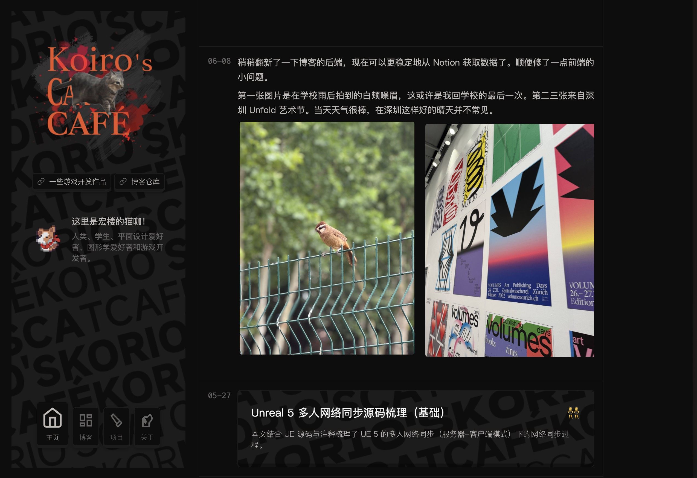

# Kotlin's Cat Café

Hello! This is a generator's repository of my blog.

This project is mainly powered by:
- [Kotlin (JVM)](https://kotlinlang.org/) 
- [Notion](https://kotlinlang.org/)
- [notion-sdk-jvm](https://github.com/seratch/notion-sdk-jvm)
- [kotlinx-html](https://github.com/Kotlin/kotlinx.html)
- [Scss](https://sass-lang.com/)

## Structure

### Two executable

- **Notion Data Collection**: `src/main/kotlin/notiondata/` package is for Notion data collecting. The main function is in `NotionData.kt`. 
 Notion data in json are collected in `notionData/` directory.
- **Html Generation**: `src/main/kotlin/Main.kt` is the starting point of html generation. It will generate html files under 
 `static/` directory.

### Stylesheet & Typescript

- **Style sheet**: use `compileSCSS_watch.sh` for watching scss files under `src/main/stylesheet/` directory.
- **Typescript**: type script files are under `src/main/typescript` directory.

